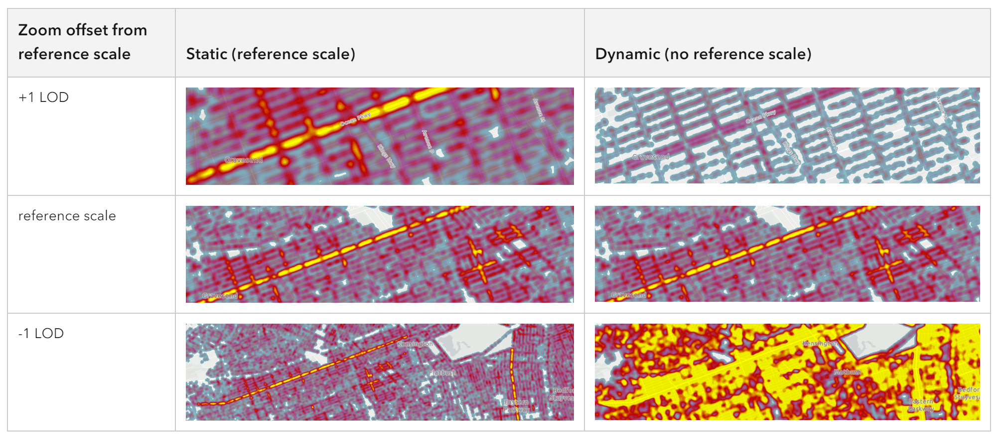
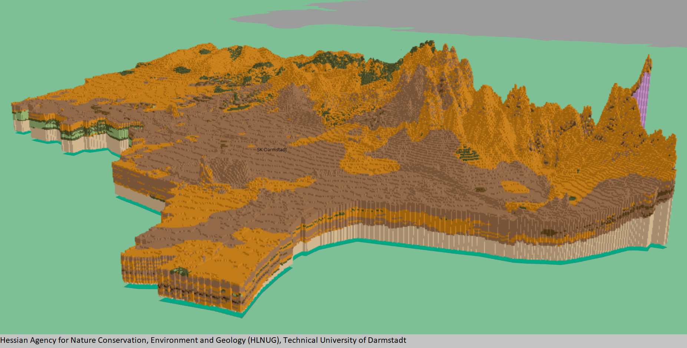

<!-- Presenter: Renardi Tanuwidjaja -->

#### Arup Spatial and Data Burst
<br> 
# ArcGIS JavaScript API
# What's New in 2022?
<br>
#### [Renardi Tanuwidjaja](renardi.tanuwidjaja@arup.com)

---

## What's new in 2022?

- [Client-side Binning](#/2)
- [FlowRenderer](#/3)
- [MediaLayer](#/4)
- [HeatmapRenderer Improvements](#/5)
- [Weather Effects](#/6)
- [Voxel Layer](#/7)
- [FeatureTable Widget Updates](#/8)

---

## Client-side Binning - what is it?

- Feature reduction method that spatially groups points into bins as a means of reducing and summarising point features.
- Can be used on FeatureLayer, CSVLayer, GeoJSONLayer, WFSLayer, or OGCFeatureLayer.

------

## Client-side Binning - basic configuration

<iframe class="snippet-preview" id="sample-featurereduction-binning" data-src="./assets/snippets/sample-featurereduction-binning.html"></iframe>

------

## Client-side Binning - summary using arcade

<iframe class="snippet-preview" id="sample-featurereduction-binning-arcade-summary" data-src="./assets/snippets/sample-featurereduction-binning-arcade-summary.html"></iframe>

------

## Client-side Binning - code snippet

```
// Layer featureReduction property - FeatureReductionBinning

layer.featureReduction = {
  type: "binning",
  fixedBinLevel: 6,
  labelsVisible: true,
  labelingInfo: [
    new LabelClass({
      minScale: 144448,
      maxScale: 0,
      deconflictionStrategy: "none",
      symbol: {
        type: "text",  // autocasts as new TextSymbol()
        color: "white",
        font: {
          family: "Noto Sans",
          size: 10,
          weight: "bold"
        },
        haloColor: colors[4],
        haloSize: 0.5
      },
      labelExpressionInfo: {
        expression: "Text($feature.aggregateCount, '#,###')"
      }
    })
  ],
  popupEnabled: true,
  popupTemplate: {
    title: "Car crashes",
    content: "{aggregateCount} car crashes occurred in this area."
  },
  renderer: {
    type: "simple",
    symbol: {
      type: "simple-fill",
      color: [0, 255, 71, 1],
      outline: null,
      outline: {
        color: "rgba(153, 31, 23, 0.3)",
        width: 0.3,
      },
    },
    visualVariables: [
      {
        type: "color",
        field: "aggregateCount",
        legendOptions: {
          title: "Number of crashes"
        },
        stops: [
          { value: 0, color: colors[0] },
          { value: 25, color: colors[1] },
          { value: 75, color: colors[2] },
          { value: 200, color: colors[3] },
          { value: 300, color: colors[4] }
        ]
      }
    ]
  }
};
```

------

## Client-side Binning - notes

- Beta
- Not supported in 3D SceneView.
- Not supported in MapImageLayer.
- Only supported for layers with a point geometry type.
- Layer views with an applied FeatureEffect cannot be binned.
- Currently, bin sizes do not dynamically change as the user zooms in and out of the map.

---

## FlowRenderer - what is it?

- The FlowRenderer allows you to visualize your raster data with animated streamlines.
- This renderer can be used to visualize flow direction and magnitude information for meteorology and oceanography raster data, e.g. wind, ocean currents.

------

## FlowRenderer - example

<iframe class="snippet-preview" id="sample-flowrenderer" data-src="./assets/snippets/sample-flowrenderer.html"></iframe>

------

## FlowRenderer - code snippet

```
// AMD:
require(["esri/renderers/FlowRenderer"], (FlowRenderer) => { /* ... */ });
// ESM:
import FlowRenderer from "@arcgis/core/renderers/FlowRenderer";

const renderer = new FlowRenderer({
  density: 1, // visualization will have the maximum amount of streamlines
  color: [50, 120, 240], // blue
  flowSpeed: 10,
  trailWidth: "2px"
});
```

------

## FlowRenderer - notes

- The FlowRenderer is only supported with ImageryTileLayer and ImageryLayer.
- The FlowRenderer is only supported in 2D MapView.
- To be used with raster dataset with magnitude and direction.

---

## MediaLayer - what is it?

- The MediaLayer class is used to add image and video elements to the map at a specified geographic location.
- Can be used to display old scanned maps, weather data, satellite imagery, aerial and drone images, fantasy images and video feedback, etc.
- The image or video can be set using the extent and rotation.

------

## MediaLayer - example

<iframe class="snippet-preview" id="sample-medialayer-video" data-src="./assets/snippets/sample-medialayer-video.html"></iframe>

------

## MediaLayer - code snippet

```
// AMD:
require(["esri/layers/MediaLayer"], (MediaLayer) => { /* ... */ });
// ESM:
import MediaLayer from "@arcgis/core/layers/MediaLayer";

// create a video element by setting video param to point to the video file url
// set the geographic location of the video file on the map using an extent
const element = new VideoElement({
  video: "https://arcgis.github.io/arcgis-samples-javascript/sample-data/media-layer/videos/hurricanes_aerosol-aug.mp4",
  georeference: new ExtentAndRotationGeoreference({
    extent: new Extent({
      xmin: -150,
      ymin: 1,
      xmax: 20,
      ymax: 80,
      spatialReference: {
        wkid: 4326
      }
    })
  })
});

// add the video element to the media layer
const layer = new MediaLayer({
  source: [element],
  title: "2017 Hurricanes and Aerosols Simulation",
  copyright: "NASA's Goddard Space Flight Center"
});
```

------

## MediaLayer - notes

- The limit of the image depends on the machine's GPU limit. The safest maximum size is 2048x2048px. The larger the image size, the longer it will take to be fetched and displayed.
- The blendMode and effect properties are not supported in 3D SceneView.
- Animated images, such as GIF or APNG, are not currently supported.

---

## HeatMapRenderer Improvements - WebGL

<p style="text-align: left">HeatmapRenderer now renders with WebGL, which means it can now take advantage of the following benefits:<p>

- More data can be rendered.
- Interacting with heatmaps is a faster, smoother experience for the end user.
- Underlying points in a heatmap display popups and can be returned in a hitTest operation.
- In MapView, data can now be labeled, and filtered using FeatureFilter and FeatureEffect.

------

## HeatMapRenderer Improvements - Static heatmaps

<p style="text-align: left">HeatmapRenderer added a referenceScale property, which allows you to lock the heatmap visualization at a specific scale so it will appear consistent when zooming in and out.</p>



---

## Weather Effects - example

<iframe class="snippet-preview" id="sample-sceneweather" data-src="./assets/snippets/sample-scene-weather.html"></iframe>

------

## Weather Effects - code snippet

```
// SceneView environment property

view.environment.weather = {
  type: "rainy",
  cloudCover: 0.7,
  precipitation: 0.3
};

// Weather widget

// AMD:
require(["esri/widgets/Weather"], (Weather) => { /* ... */ });
// ESM:
import Weather from "@arcgis/core/widgets/Weather";

const widget = new Weather({ view: view });
```

---

## Voxel Layer - what is it?

- A voxel layer represents multidimensional volumetric data.



------

## Voxel Layer - example

<iframe class="snippet-preview" id="sample-voxellayer" data-src="./assets/snippets/sample-voxellayer.html"></iframe>

------

## Voxel Layer - notes

- VoxelLayer requires WebGL2 and the EXT_color_buffer_float extension.
- Visualizing voxels with data type INT16 or UINT16 additionally requires the EXT_texture_norm16 extension, which is currently only supported by the Chrome browser.
- Visualizing voxels with data type FLOAT32 additionally requires the OES_texture_float_linear extension.
- For best performance, use Chrome browser and a dedicated graphics card.
- Mobile support differs across devices. Voxel scene layers are not recommended for use on mobile.

---


## FeatureTable Widget Updates

- More table and column configuration - e.g. grouped columns.
- Improved editing.

<iframe class="snippet-preview" id="sample-featuretable" data-src="./assets/snippets/sample-featuretable.html"></iframe>

---

# Questions?